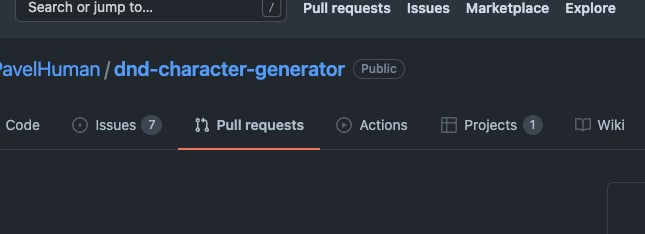
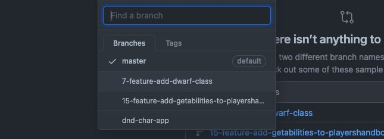
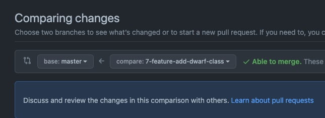
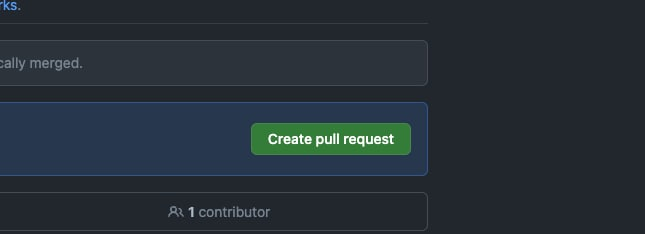
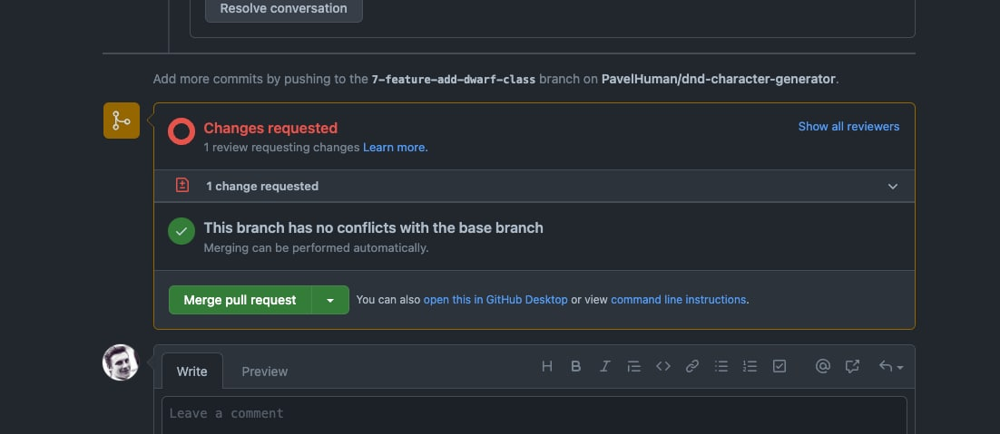

# How to create a Pull Request?

1. перейти в раздел пулл реквестов `Pull requests`

  

2. нажать создать новый пулл реквест `New pull request`

  

3. выбрать нужную ветку

  

  чтобы было вот так

  

4. создать пулл реквест нажав `Create pull request`

  

5. Добавить ревьюеров

  Если ревьюер запросил необходимость изменений, то не мёржим, до тех пор пока не получен апрув
  
  

  мёржим после того, как апрув получен

  

