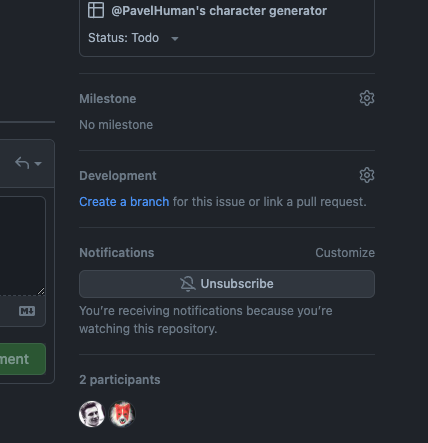
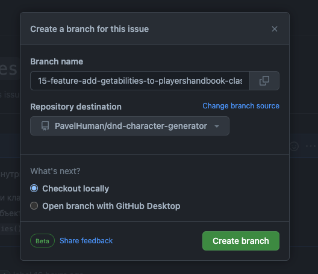
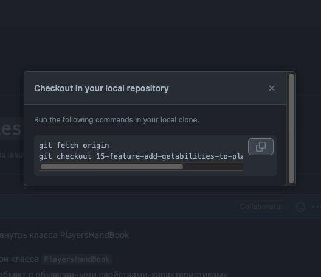
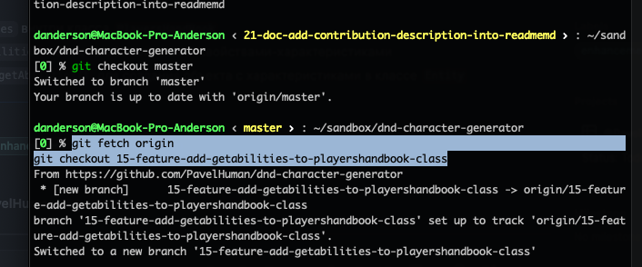

# How to resolve issues

1. на странице `issue` в правом сайдбаре нажать `Create a branch` в разделе `Development`

   

2. выбрать `Checkout locally` -> `Create branch`

   
    
3. скопировать и запустить команды в локальном репозитории находясь на ветке `master`
   1. скопировать гит команды из модального окна

   

   1. свичнуться в `master`

  ```shell
    git checkout master
  ```

   3. вставить скопированные из модалки команды

   
